# High-Level System Diagram

This diagram clearly illustrates the context and specific roles of LLMs within the Synnex Bot message processing flow.

```mermaid
graph LR
    %% Styles
    classDef user fill:#fff,stroke:#333,stroke-width:2px;
    classDef platform fill:#00b900,stroke:#333,stroke-width:2px,color:white;
    classDef llm fill:#e1d5e7,stroke:#9673a6,stroke-width:2px,rx:5,ry:5;
    classDef db fill:#dae8fc,stroke:#6c8ebf,stroke-width:2px,shape:cylinder;
    classDef logic fill:#fff,stroke:#333,stroke-width:2px,rx:5,ry:5;
    
    %% Nodes
    User(("User")):::user
    LINE("LINE Platform"):::platform
    
    subgraph Processing["Message Processing Pipeline"]
        direction LR
        
        Input("Incoming Message"):::logic
        
        subgraph Understanding["1. Understanding"]
            LLM_Extract["LLM: Metadata Extraction<br>(Brand, Category, Price)"]:::llm
            LLM_Rewrite["LLM: Contextual Rewriting<br>(History Aware Query)"]:::llm
        end
        
        subgraph Retrieval["2. Retrieval & Ranking"]
            OpenSearch[("OpenSearch<br>(Vector/Keyword)")]:::db
            Rules["Price & Stock Filters"]:::logic
        end
        
        subgraph Synthesis["3. Synthesis"]
            LLM_Sum["LLM: Summarization & Recommendation<br>(Natural Language Output)"]:::llm
            CardGen["Flex Message Generator"]:::logic
        end
    end

    %% Flow
    User -->|Message| LINE
    LINE -->|Webhook| Input
    
    Input -->|"Raw Text"| LLM_Extract
    LLM_Extract -->|"Structured Data"| LLM_Rewrite
    
    LLM_Rewrite -->|"Optimized Query"| OpenSearch
    
    OpenSearch -->|"Raw Hits"| Rules
    Rules -->|"Filtered Products"| LLM_Sum
    
    LLM_Sum -->|"Recommendation Text"| CardGen
    Rules -->|"Product Data"| CardGen
    
    CardGen -->|"Final Response (Text + Cards)"| LINE
```

## LLM Process Context

The system utilizes Large Language Models (LLMs) at three critical stages:

1.  **Metadata Extraction**: 
    *   **Input**: User's raw message (e.g., "I want a Samsung phone under 20k").
    *   **Action**: Extracts structured entities.
    *   **Output**: JSON `{brand: "Samsung", category: "Phone", price_max: 20000}`.

2.  **Contextual Rewriting**:
    *   **Input**: Current query + Chat History.
    *   **Action**: Resolves references (e.g., "how about iPhone?" -> "Show me iPhone price and specs").
    *   **Output**: A standalone, search-optimized query string.

3.  **Summarization & Recommendation**:
    *   **Input**: List of products retrieved from OpenSearch.
    *   **Action**: Generates a helpful, human-like summary explaining why these products match.
    *   **Output**: "Here are the top Samsung phones under 20,000 THB. The Galaxy A55 is a great choice because..."
